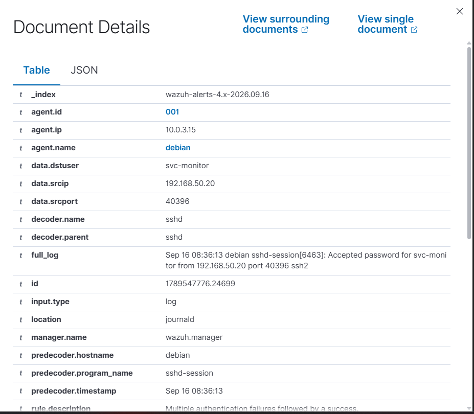
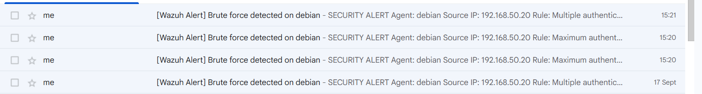
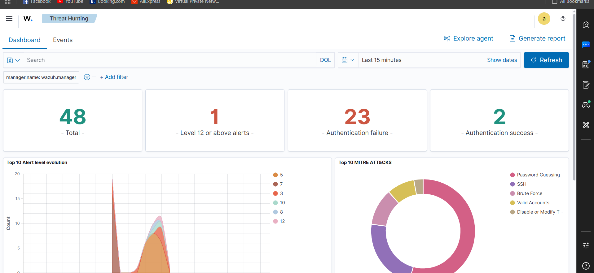

# SOC Analyst Portfolio Project — SSH Brute Force Detection & Automated Response

A self-built home-lab SOC environment demonstrating end-to-end detection engineering: from a live SIEM deployment through a multi-stage simulated intrusion to automated containment and analyst-style incident write-ups.

**What this demonstrates:** SIEM deployment (Wazuh), log-based detection engineering, MITRE ATT&CK mapping, automated active response (blocking + alerting), and — critically — the analyst judgment to tell a real attack apart from a false positive.

---

## 1. Architecture

```
┌─────────────────┐         Internal Network          ┌──────────────────────┐
│   Kali Linux     │◄──────── 192.168.50.x ──────────►│   Debian 13 "Victim"  │
│   (Attacker)     │        VirtualBox VAPT-LAB-2      │  SSH exposed          │
│  192.168.50.20   │                                    │  192.168.50.10        │
└─────────────────┘                                    └───────────┬──────────┘
                                                                     │ NAT
                                                                     ▼
                                                        ┌──────────────────────┐
                                                        │   Wazuh Agent          │
                                                        │   v4.9.2               │
                                                        └───────────┬──────────┘
                                                                     │
                                                                     ▼
                                              ┌──────────────────────────────────┐
                                              │  Wazuh SIEM (Docker, host machine) │
                                              │  Manager + Indexer + Dashboard     │
                                              └───────────────┬──────────────────┘
                                                               │ Active Response
                                                    ┌──────────┴──────────┐
                                                    ▼                     ▼
                                          iptables auto-block    Email alert (Gmail SMTP)
```

**Accounts on the victim:**
- `jpatel` — simulated legitimate employee (normal daily activity, occasional real typos)
- `svc-monitor` — service account with a deliberately weak password (`Summer2024!`) — the attack target

---

## 2. Detection & Response Design

| Layer | Tool | Purpose |
|---|---|---|
| SIEM | Wazuh 4.9.2 (Docker, single-node) | Central log collection, correlation, alerting |
| Log source | journald → Wazuh agent | SSH auth events, PAM, syscall-level activity |
| Correlation | Wazuh Rule 40112 | "Multiple authentication failures followed by a success" |
| Early warning | Wazuh Rule 5758 | "Maximum authentication attempts exceeded" (in-progress attack) |
| Containment | Custom Active Response script (bash) | Auto-blocks attacker IP via `iptables` |
| Notification | Custom Active Response script (Python/smtplib) | Real-time email via Gmail SMTP |
| Persistence detection | Wazuh File Integrity Monitoring (real-time) | Catches SSH `authorized_keys` tampering |

### Why two response tiers, not one

Active response is **deliberately split by confidence level**:

- **Rule 5758 (repeated failures) → email only, no block.** This can also fire on a legitimate user struggling with their password (see False Positive test below). An unnecessary email costs a few seconds of a human's attention; an unnecessary auto-block locks out a real employee. The asymmetry in cost justifies being more permissive with notifications than with containment.
- **Rule 40112 (failures *then* a success) → email + auto-block.** This requires a confirmed compromise, not just a suspicious pattern, before anything automated actually disrupts access.

This is the single most important design decision in the project, and the one most worth discussing in an interview.

---

## 3. Scenario 1 — Confirmed Attack (baseline case)

**Setup:** `svc-monitor` has a weak password. An external actor (Kali, `192.168.50.20`) runs a throttled brute force (`hydra`, one attempt every 4 seconds — mimicking an attacker trying to stay under naive rate-limiting) against it.

**What fired:**

| Field | Value |
|---|---|
| Rule | 40112 |
| Level | 12 (High) |
| Description | Multiple authentication failures followed by a success |
| Source IP | 192.168.50.20 |
| Target account | svc-monitor |
| MITRE Technique | T1110 (Brute Force) / T1078 (Valid Accounts) |



**Response:** IP `192.168.50.20` auto-blocked via `iptables` within seconds; confirmed by a failed `ping` from Kali afterward (100% packet loss). Two emails arrived — an early warning (Rule 5758) followed by the confirmed-compromise alert (Rule 40112).



**Dashboard overview for this window:**



---

## 4. Scenario 2 — False Positive (the analyst judgment test)

**Setup:** `jpatel`, a real employee, mistypes their password 3 times, then logs in correctly — no malicious intent.

**What fired:** Rule 2502 ("User missed the password more than one time"), **level 10** — a *different, lower-severity* rule than the real attack's Rule 40112, **level 12**.

**Why they scored differently:** Rule 40112 specifically watches for failures-then-success *within one continuous SSH session*. The attacker's hydra tool kept retrying inside a single connection until it succeeded. `jpatel`'s failed attempts each closed the connection (SSH's default behavior after a few tries); the eventual success came from a **fresh** connection. That "give up and reconnect" pattern is much more consistent with a human than a persistent automated tool — and Wazuh's own correlation logic already reflects that distinction structurally.

**Active response:** did **not** fire — correctly. No block, no auto-alert email, because this never crossed the confirmed-compromise threshold. It remained visible in the dashboard for analyst review only.

**Analyst reasoning applied** (the "two hypotheses" method):
1. **Source IP** — inconclusive in this lab (both tests originated locally), but in production this is the strongest signal: known internal IP vs. unfamiliar external IP.
2. **Account type** — `jpatel` is a human account; humans mistype. `svc-monitor` is a service account; a stored credential doesn't "typo" itself.
3. **Timing pattern** — irregular gaps (human) vs. suspiciously exact intervals (scripted).
4. **Session behavior** — reconnect-after-failure (human) vs. persistent single-session retrying (bot).

---

## 5. Scenario 3 — Failed-Only Attack (detection without escalation)

**Setup:** A wordlist attack against `jpatel` using passwords guaranteed not to match.

**What fired:** Repeated Rule 5760 (authentication failed) → Rule 5758 (max attempts exceeded, level 8) once SSH's internal retry cap was hit. **Rule 40112 never fired** — there was no success to correlate against.

**Active response:** Early-warning email fired (Rule 5758); no auto-block, since nothing was actually compromised — correctly conservative.

This demonstrates the system won't cry wolf with automated containment just because someone *tried* — only when they *succeeded*.

---

## 6. Scenario 4 — Full Kill Chain

A multi-stage simulation mapping to several MITRE ATT&CK phases, rather than a single isolated alert.

| Stage | MITRE Tactic | Action | Detected? | Evidence |
|---|---|---|---|---|
| 1. Reconnaissance | Reconnaissance | `nmap -sV -p-` full port scan from Kali | **No** — documented scope gap | N/A |
| 2. Initial Access | Initial Access / Valid Accounts (T1078) | SSH brute force succeeds | **Yes** | Rule 40112 |
| 3. Discovery | Discovery | `whoami`, `id`, `sudo -l`, `cat /etc/passwd` as compromised account | Partial | `sudo -l` failure confirms no privilege escalation |
| 4. Persistence | Persistence (T1098.004) | Plant attacker's SSH key in `~/.ssh/authorized_keys` | **Yes** — real-time | Rule 550, full hash diff |
| 5. Containment | — | Auto-block + email | **Yes** | iptables DROP rule, email log |

### On the undetected recon stage

Wazuh, as deployed here, is a **host-based** agent — it sees what happens *on* the victim (its logs, its files, its processes). A port scan is network-level: packets arriving from outside, largely invisible to a host-based agent unless a service actually logs the connection. `nmap -sV`'s lightweight probes generated no logged authentication or session events on the victim.

This is called out explicitly as a **scope limitation**, not hidden or treated as a false negative: closing this gap would require a network-level IDS/IPS (e.g. Suricata, Snort) — a different tool category than what was deployed here.

### Persistence detection detail

Wazuh's default File Integrity Monitoring configuration does **not** watch `/home` — only `/etc`, `/bin`, `/sbin`, `/boot`, `/usr/bin`, `/usr/sbin`. This was identified during testing and fixed by adding a real-time (`inotify`-based) watch on `/home` specifically, since SSH persistence techniques land there. The resulting alert (Rule 550, level 7) included full before/after size and hash comparison (MD5/SHA1/SHA256), detected within ~10-15 seconds of the file being touched.

---

## 7. Live Agent & System Status


---

## 8. Skills Demonstrated

- SIEM deployment and administration (Wazuh via Docker)
- Linux system administration (Debian networking, SSH hardening, iptables, systemd)
- Detection rule interpretation and correlation logic (Wazuh rule engine)
- MITRE ATT&CK framework mapping
- Scripting for security automation (Bash + Python active-response integrations)
- SMTP-based alerting (Python `smtplib`, Gmail App Password auth)
- File Integrity Monitoring configuration and real-time detection
- True positive vs. false positive triage — the "two hypotheses" investigative method
- Documenting a deliberate security design trade-off (alerting broadly vs. containing narrowly) with clear reasoning
- Honest scope-limitation reporting (recon-stage detection gap)

## 9. What's Next

- Additional incident type for breadth (e.g. phishing email analysis or malware/EICAR file-drop detection) — planned as a follow-up, deliberately scoped out of v1 to avoid diluting depth with premature breadth
- Network-level detection (Suricata/Snort) to close the reconnaissance-stage gap

---

*Full build runbook, including every command used to reproduce this environment from scratch, is included in this repo as `SOC-Lab-Runbook.md`.*
